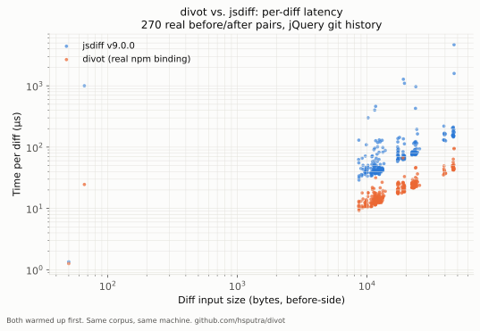
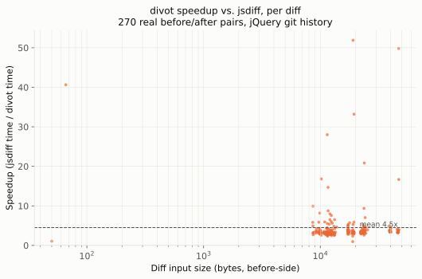
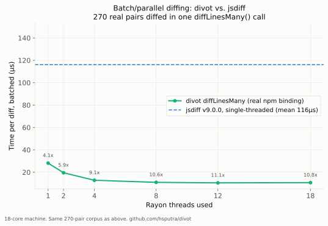

# divot

Fast diff/patch engine, in Rust, with Python and Node bindings.

## Why

[jsdiff](https://github.com/kpdecker/jsdiff) (138M weekly downloads) is
the dominant diff library on npm, and its own docs admit a real
performance compromise: linked-list diagonal tracking instead of
optimized array-based Myers diff. divot's core is built on
[`imara-diff`](https://github.com/pascalkuthe/imara-diff) — the diff
engine that powers `gitoxide` in production — which doesn't make that
trade-off, and additionally implements the Histogram algorithm (git's
modern default: faster *and* more human-readable for code than plain
Myers).

## Benefits

- **~4x faster than jsdiff for a single diff**, ~11x for batch workloads
  (many files at once) — both measured through the real compiled native
  addon, not the underlying Rust library in isolation. See
  [Performance](#performance) for the full, honest breakdown, including
  where the numbers came *down* from bigger ones once FFI cost was
  accounted for.
- **`jsdiff`-shaped API** (`diffLines`/`diffWords`/`diffChars`, the same
  `{value, added, removed, count}` result shape) — switching from `diff`
  is close to a drop-in change, not a rewrite.
- **Batch diffing with built-in parallelism** (`diffLinesMany`) — a
  capability jsdiff structurally can't offer (it's single-threaded with
  no batch API at all). Useful for linting a whole PR or diffing every
  file in a directory in one call.
- **Real correctness guarantees, not just speed**: every diff function
  is tested to reconstruct the original `before`/`after` text exactly
  from its output, including multibyte UTF-8 — not just "looks right on
  an example."
- Built on `imara-diff`, the same diff engine trusted in production by
  `gitoxide` — not a from-scratch reimplementation of something
  security/correctness-sensitive.

## Installation

**Not yet published to npm or PyPI.** To use it today, build from
source:

```sh
git clone https://github.com/hsputra/divot.git
cd divot
npm install
npm run build   # compiles the native addon via napi-rs
```

This produces `index.js`/`index.d.ts` (already committed) plus a
platform-specific `divot.<platform>.node` binary. `require("./divot")`
(or `require("/path/to/divot")`) from there.

## How to use

```js
const { diffLines, diffWords, diffChars, unifiedDiff, diffLinesMany } = require("divot");
```

### `diffLines(before, after)`

```js
const before = "function greet(name) {\n  console.log('Hello ' + name);\n}\n";
const after  = "function greet(name) {\n  console.log(`Hello ${name}!`);\n}\n";

for (const part of diffLines(before, after)) {
  const prefix = part.added ? "+" : part.removed ? "-" : " ";
  console.log(prefix + part.value.trimEnd());
}
//  function greet(name) {
// -  console.log('Hello ' + name);
// +  console.log(`Hello ${name}!`);
//  }
```

### `diffWords(before, after)` / `diffChars(before, after)`

Same shape, finer granularity:

```js
diffWords("the quick brown fox", "the slow brown fox");
// [
//   { value: "the ", added: false, removed: false, count: 2 },
//   { value: "quick", added: false, removed: true, count: 1 },
//   { value: "slow", added: true, removed: false, count: 1 },
//   { value: " brown fox", added: false, removed: false, count: 4 },
// ]
```

### `unifiedDiff(before, after)`

Real `git diff`/`diff -u`-style patch text:

```js
console.log(unifiedDiff(before, after));
// @@ -1,3 +1,3 @@
//  function greet(name) {
// -  console.log('Hello ' + name);
// +  console.log(`Hello ${name}!`);
//  }
```

### `diffLinesMany(pairs)` — batch, parallel across CPU cores

For diffing many files at once (the realistic shape of CI/lint/AI-agent
workloads), not a loop of individual `diffLines` calls:

```js
const results = diffLinesMany([
  { before: fileAContentOld, after: fileAContentNew },
  { before: fileBContentOld, after: fileBContentNew },
  // ...
]);
// results[i] is exactly what diffLines(pairs[i].before, pairs[i].after)
// would return -- diffLinesMany just does all of them across a Rayon
// thread pool instead of one at a time.
```

Only reaches for this when you actually have many pairs — for a single
diff, plain `diffLines` is the right call; see
[Performance](#performance) for why.

## Performance

Real, measured, reproducible — not projected. 270 before/after pairs
extracted from jQuery's actual git history (`src/event.js`, `css.js`,
`core.js`, `manipulation.js`, `selector.js`, `ajax.js`, `effects.js`,
`deferred.js`), diffed with the real `diff` npm package (jsdiff v9.0.0)
and with divot, same corpus, both warmed up first.

| | Time/pair | vs. jsdiff |
|---|---|---|
| jsdiff v9.0.0 (`diffLines`) | 118.96µs | — |
| **divot, via the real npm binding** | **29.9µs** | **~4.0x** |
| divot, pure Rust (no FFI) | ~19.8µs | ~5.9x |

**~4.0x is the number that matters** — it's what `npm install divot`
actually delivers, measured through the real compiled native addon, not
the underlying Rust library in isolation. The pure-Rust figure is shown
for transparency about where FFI (UTF-16→UTF-8 conversion in, JS object
construction out) costs real time, not to imply it's what you'll
observe from JS.




Full methodology, raw CSV data, and the chart-generation script are in
[`plots/`](plots/).

### Batch diffing: a real capability jsdiff can't offer

`diffLinesMany()` diffs many pairs at once across all available CPU
cores (via Rayon internally) — not an algorithm improvement over
`imara-diff`, a different capability entirely: jsdiff is single-threaded
with no built-in batch API, so this isn't something it can match by
being faster, only by the caller manually parallelizing across worker
threads/processes themselves.

| | Time/pair | vs. jsdiff (looped) |
|---|---|---|
| jsdiff v9.0.0, called in a loop | ~118.4µs | — |
| **`diffLinesMany`, real npm binding, 18 cores** | **~10.5µs** | **~11x** |

Verified this is genuinely about parallelism and not some batching
trick: forcing a single Rayon thread reproduces the non-batched ~19.8µs
pure-Rust number exactly. **The multiplier scales with available cores**
— it's a batch-throughput number, not a claim that any single diff got
11x faster. Useful for realistic bulk workloads (lint a whole PR, diff
every file in a directory), less useful for a one-off single diff, where
`diffLines()` is the right call.



## Status

Early. Implemented and tested: line/word/char diffing, unified diff
output, npm binding (`diffLines`/`diffWords`/`diffChars`/`unifiedDiff`/
`diffLinesMany`, real native addon, real tests via Node's built-in test
runner). No CLI yet.

Not yet implemented: Python bindings (PyO3), a fuzzy/atomic
patch-application layer (the planned differentiator for LLM-coding-agent
workflows — see the project's technical spec for detail on the failure
modes it targets). Nothing here is published to any registry yet.

## Credit

Built on [`imara-diff`](https://github.com/pascalkuthe/imara-diff)
(Apache-2.0) by Pascal Kuthe — the diff computation itself is that
crate's work; this project adds word/char tokenization (not provided
upstream), a `jsdiff`-compatible result shape, batch/parallel diffing,
and (planned) the patch-application layer.

## License

Dual-licensed under MIT or Apache-2.0, at your option.
